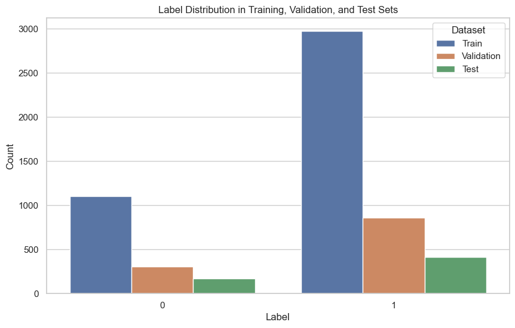

# Chest X-Ray Pneumonia Classification using Convolutional Neural Networks

## Table of Contents
  1. [Introduction](#introduction)<br>
  2. [Datasets](#datasets)<br>
  3. [Exploratory Data Analysis](#eda)<br>
  4. [Preprocess Data](#preprocess)<br>
  5. [Neural Network](#neural-network)<br>
  6. [Model Training](#model-train)<br>
  7. [Model Evaluation](#model-evaluation)<br>
  8. [Prediction and Visualization](#predict-visualize)<br>

## <a name="introduction"> Introduction</a>
This project aims to develop a Convolutional Neural Network (CNN) for accurately classifying chest X-ray images for the presence of pneumonia. The goal is to build a model capable of distinguishing between normal and pneumonia-affected X-ray images. The project is divided into various key sections, including data loading, data preprocessing, neural network architecture, model training, evaluation, and result visualization.

## <a name="datasets"> Datasets</a>
The project begins by loading the dataset using the "keremberke/chest-xray-classification" dataset provided through the "datasets" module from Huggingface Community. The dataset comprises training, validation, and test sets of X-ray images with a size of 640x640 pixels. The dataset structure is stored in the variables X and y, where X represents the training data, and y represents the validation data.


## <a name="eda"> Exploratory Data Analysis</a>
A function named visualize_random_data is defined to visualize a random subset of the training data. This function displays a specified number of images along with their labels.



## <a name="preprocess"> Preprocess Data</a>
Data preprocessing is a critical step before training the CNN model. The following steps are performed to preprocess the X-ray images:

1. Open and resize the image to 28x28 pixels.
2. Convert the image to grayscale.
3. Convert the image to a NumPy array and reshape it to (28, 28, 1).
4. Normalize pixel values to the range [0, 1].

The preprocessed data is then divided into three sets: training, validation, and test sets. Images and their corresponding labels are stored in separate arrays.


## <a name="neural-network"> Neural Network</a>
A CNN model is defined using TensorFlow's Keras API. The model architecture includes convolutional layers, max-pooling layers, and fully connected (dense) layers. The model consists of several layers:

```python
tf.random.set_seed(64)
model = Sequential(
    [
        Conv2D(64, (3, 3), activation='relu', input_shape=(28, 28 ,1)),
        MaxPooling2D(2, 2),
        Conv2D(64, (3, 3), activation='relu'),
        MaxPooling2D(2,2),
        Flatten(),
        Dense(256, activation='relu', name='L1'),
        Dense(128, activation='relu', name='L2'),
        Dense(64, activation='relu', name='L3'),
        Dense(32, activation='relu', name='L4'),
        Dense(16, activation='relu', name='L5'),
        Dense(2, activation='sigmoid', name='L6')
    ], name = "my_model"
)

model.compile(
    loss=tf.keras.losses.SparseCategoricalCrossentropy(from_logits=True),
    optimizer=tf.keras.optimizers.Adam(learning_rate=0.001),
    metrics=['accuracy']  # Add accuracy as a metric for monitoring
)
```
- Convolutional layers with ReLU activation.
- Max-pooling layers.
- Fully connected (dense) layers with ReLU activation.
- The output layer with a sigmoid activation function.

The model is compiled with a loss function, an optimizer, and accuracy as a monitoring metric.


## <a name="model-train"> Model Training</a>
The CNN model is trained using the training data. The training process involves specifying the number of epochs and using the validation data for monitoring the model's performance. The training history is stored in the history variable.

## <a name="model-evaluation"> Model Evaluation</a>


## <a name="predict-visualize"> Prediction and Visualization</a>

