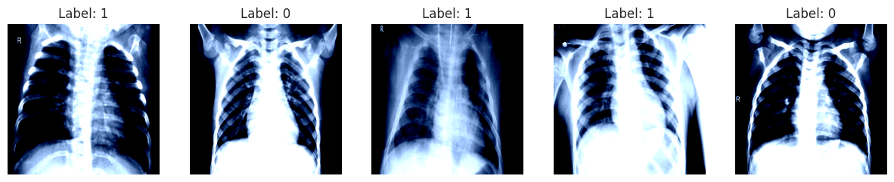
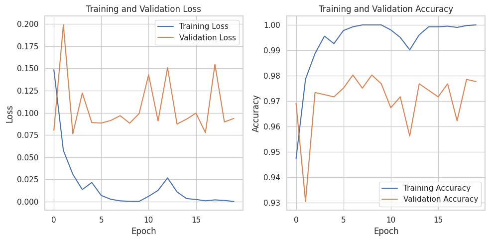
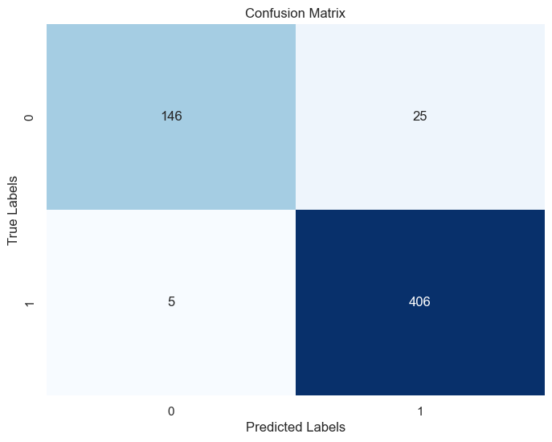
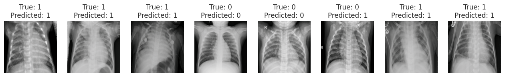

# Chest X-Ray Pneumonia Classification using Convolutional Neural Networks

## Table of Contents
  1. [Introduction](#introduction)<br>
  2. [Datasets](#datasets)<br>
  3. [Exploratory Data Analysis](#eda)<br>
  4. [Transform Data](#transform)<br>
  5. [Model](#model)<br>
  6. [Training](#training)<br>
  7. [Evaluation](#evaluation)<br>
  8. [Prediction and Visualization](#predict-visualize)<br>
  9. [Summary](#summary)<br>

## <a name="introduction"> Introduction</a>
This project focuses on fine-tuning a pre-trained ResNet-18 model to accurately classify chest X-ray images for the presence of pneumonia. The objective is to leverage the power of transfer learning to develop a model capable of distinguishing between normal and pneumonia-affected X-ray images. The project is organized into several key sections: data loading, data preprocessing, model architecture modification, model training, evaluation, and result visualization.

## <a name="datasets"> Datasets</a>
The project begins by loading the dataset using the "keremberke/chest-xray-classification" dataset provided through the "datasets" module from Huggingface Community. The dataset comprises training, validation, and test sets of X-ray images with a size of 640x640 pixels. The dataset structure is stored in the variables X and y, where X represents the training data, and y represents the validation data.


## <a name="eda"> Exploratory Data Analysis</a>
Dataset Statistics:

- Training Set Size: 4077 samples
- Validation Set Size: 1165 samples
- Test Set Size: 582 samples


It's worth noting that the class distributions in the dataset are not perfectly balanced. However, through testing and monitoring, it has been observed that this class imbalance may not significantly impact the model's performance and final output.


## <a name="transform"> Transform Data</a>
Before training the ResNet-18 model, the X-ray images need to be appropriately transformed to fit the model's requirements. The following transformations are applied to the dataset:

1. Custom Dataset: A custom dataset class is utilized to load and transform the images, ensuring they meet the input requirements of the model.
2. Grayscale to RGB Conversion: Since ResNet-18 expects RGB images, the grayscale X-ray images are converted to RGB by repeating the single grayscale channel.
3. Resizing: All images are resized to 224x224 pixels, the standard input size for ResNet-18.
4. Normalization: The images are normalized using ImageNet mean and standard deviation values to stabilize and improve the training process.
5. DataLoader Setup: The dataset is split into training, validation, and test sets, with DataLoader objects created to handle batch processing during model training and evaluation.

These are some samples of the dataset (training set) after transformation:




## <a name="model"> Model (Resnet18 Pre-trained)</a>
In this project, I fine-tune a pre-trained ResNet-18 model to classify chest X-ray images as either normal or pneumonia-affected. ResNet-18 is a popular deep convolutional neural network architecture known for its residual blocks, which help in training very deep networks by mitigating the vanishing gradient problem.

<b>ResNet-18 Architecture</b>

Below is a visual representation of the ResNet-18 architecture:


The model consists of several convolutional layers, each followed by a batch normalization layer and a ReLU activation function. The layers are organized into blocks, with shortcut connections that add the input of each block to its output, aiding in the flow of gradients during training.

<b>Model Customization</b>

1. Loading the pre-trained ResNet-18 Model: I start by loading a ResNet-18 model pre-trained on ImageNet.
```python
resnet18 = models.resnet18(pretrained=True)
```

2. Adjusting the Output Layer: The final fully connected layer is modified to output two classes, suitable for the binary classification task.
```python
num_features = resnet18.fc.in_features
resnet18.fc = nn.Linear(num_features, 2)
```

3. Freezing Layers
In the ResNet-18 architecture, I freeze the initial layers up to the layer3 block to use the model as a feature extractor. Only the deeper layers (layer4 and fc) are left unfrozen to allow fine-tuning on the pneumonia dataset.
```python
# Freeze the initial layers to use ResNet-18 purely as a feature extractor
for param in resnet18.parameters():
    param.requires_grad = False

# Unfreeze the last few layers
for param in resnet18.layer4.parameters():
    param.requires_grad = True
```

These adjustments allow the ResNet-18 model to effectively learn from the pneumonia dataset while leveraging its pre-trained weights for optimal performance.


## <a name="training"> Training</a>

<b>Training Setup</b>

Before starting the training loop, I set up the device (GPU or CPU), define the loss function, and specify the optimizer:
```python
# Move the model to the appropriate device (CPU or GPU)
device = torch.device('cuda' if torch.cuda.is_available() else 'cpu')
resnet18.to(device)

# Define the loss function and optimizer
criterion = nn.CrossEntropyLoss()
optimizer = optim.Adam(resnet18.parameters(), lr=0.001)
```

<b>Training Loop</b>

The model is trained for 20 epochs. During each epoch, the training loop performs the following tasks:

Training Phase:
- The model is set to training mode, and the loss is calculated for each batch of data.
- Gradients are computed and the optimizer updates the model's weights.
- Accuracy is tracked for the training data.

Validation Phase:
- The model is evaluated on the validation set without updating the weights.
- Loss and accuracy are tracked to monitor the model's performance on unseen data.

```python
from tqdm.notebook import tqdm

# Training loop
num_epochs = 20
train_losses, val_losses = [], []
train_accuracies, val_accuracies = [], []

model = resnet18

for epoch in range(num_epochs):
    model.train()
    running_loss = 0.0
    correct_train = 0
    total_train = 0
    
    for inputs, labels in tqdm(train_loader):
        inputs, labels = inputs.to(device), labels.to(device)
        optimizer.zero_grad()
        outputs = model(inputs)
        loss = criterion(outputs, labels)
        loss.backward()
        optimizer.step()
        running_loss += loss.item()
        
        # Calculate accuracy
        _, predicted = torch.max(outputs.data, 1)
        total_train += labels.size(0)
        correct_train += (predicted == labels).sum().item()
    
    train_losses.append(running_loss / len(train_loader))
    train_accuracies.append(correct_train / total_train)
    
    # Validation step
    model.eval()
    val_loss = 0.0
    correct_val = 0
    total_val = 0
    
    with torch.no_grad():
        for inputs, labels in tqdm(val_loader):
            inputs, labels = inputs.to(device), labels.to(device)
            outputs = model(inputs)
            loss = criterion(outputs, labels)
            val_loss += loss.item()
            
            # Calculate accuracy
            _, predicted = torch.max(outputs.data, 1)
            total_val += labels.size(0)
            correct_val += (predicted == labels).sum().item()
    
    val_losses.append(val_loss / len(val_loader))
    val_accuracies.append(correct_val / total_val)
    
    print(f'Epoch {epoch+1}/{num_epochs}, Train Loss: {train_losses[-1]:.4f}, Train Accuracy: {train_accuracies[-1]:.4f}, Validation Loss: {val_losses[-1]:.4f}, Validation Accuracy: {val_accuracies[-1]:.4f}')
```

## <a name="evaluation"> Evaluation</a>
During training and evaluating, I focus on two primary metrics to assess the performance of our fine-tuned ResNet-18 model:

1. <b>Loss:</b>
The loss function used here is Cross-Entropy Loss, which measures how well the model's predictions match the actual labels. Lower loss values indicate better performance.

2. <b>Accuracy:</b>
Accuracy is a straightforward metric that represents the proportion of correctly predicted labels out of the total predictions. Higher accuracy means the model is making more correct predictions.

<b>Result</b>

Training and Validation Loss:
- The loss graph shows that the training loss decreases steadily, indicating that the model is learning effectively.
- However, the validation loss fluctuates, suggesting that the model may be slightly overfitting to the training data. This behavior is common when the model starts to specialize in the training set rather than generalizing well on unseen data.
  
Training and Validation Accuracy:
- The accuracy graph shows a high training accuracy, which quickly reaches close to 100%.
- The validation accuracy also improves, but it exhibits some fluctuations, reflecting the variation in the model's performance on unseen data. Despite this, the validation accuracy remains high, indicating the model's overall good performance.




These metrics indicate the model's performance on both the training and validation datasets. The training loss and accuracy reflect how well the model learned from the training data, while the validation loss and accuracy provide insights into its generalization capabilities.


## <a name="predict-visualize"> Predictions on Test Data</a>
The model's performance on the test data is summarized as follows:
- Test loss: 0.1288
- Test accuracy: 0.9759



The confusion matrix provides a detailed breakdown of the model's predictions, highlighting true positives, true negatives, false positives, and false negatives, which is crucial for assessing the model's performance in binary classification tasks.

These are some visualized predictions of the model:




## <a name="summary"> Summary</a>
In this project, I successfully fine-tuned a pre-trained ResNet-18 model to classify chest X-ray images for pneumonia detection. By transforming grayscale X-ray images into RGB format, resizing them to 224x224 pixels, and normalizing them according to ImageNet standards, I adapted the dataset to the model’s requirements. I froze the early layers of ResNet-18 to leverage its pre-trained features while fine-tuning the deeper layers for our specific task. The model achieved a high test accuracy of approximately 97.6%, demonstrating its effectiveness in distinguishing between normal and pneumonia-affected images. This project underscores the potential of using transfer learning and CNNs for reliable medical image classification.

