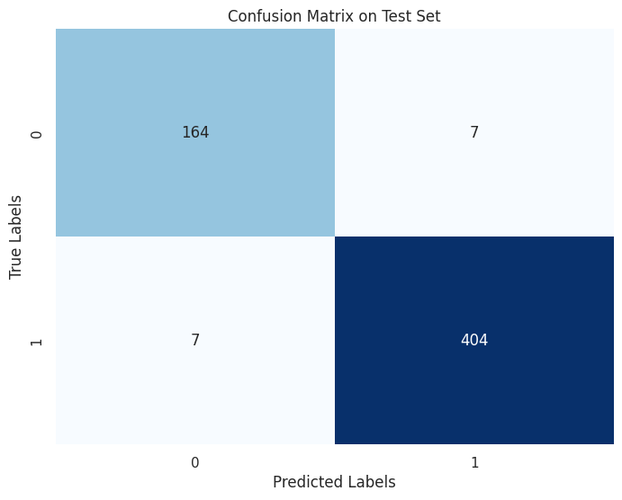

# Chest X-Ray Pneumonia Classification using Convolutional Neural Networks

## Table of Contents
  1. [Introduction](#introduction)<br>
  2. [Datasets](#datasets)<br>
  3. [Exploratory Data Analysis](#eda)<br>
  4. [Transform Data](#transform)<br>
  5. [Model](#neural-network)<br>
  6. [Training](#training)<br>
  7. [Evaluation](#model-evaluation)<br>
  8. [Prediction and Visualization](#predict-visualize)<br>
  9. [Summary](#summary)<br>

## <a name="introduction"> Introduction</a>
This project focuses on fine-tuning a pre-trained ResNet-18 model to accurately classify chest X-ray images for the presence of pneumonia. The objective is to leverage the power of transfer learning to develop a model capable of distinguishing between normal and pneumonia-affected X-ray images. The project is organized into several key sections: data loading, data preprocessing, model architecture modification, model training, evaluation, and result visualization.

## <a name="datasets"> Datasets</a>
The project begins by loading the dataset using the "keremberke/chest-xray-classification" dataset provided through the "datasets" module from Huggingface Community. The dataset comprises training, validation, and test sets of X-ray images with a size of 640x640 pixels. The dataset structure is stored in the variables X and y, where X represents the training data, and y represents the validation data.


## <a name="eda"> Exploratory Data Analysis</a>
Dataset Statistics:

- Training Set Size: 4077 samples
- Validation Set Size: 1165 samples
- Test Set Size: 582 samples


It's worth noting that the class distributions in the dataset are not perfectly balanced. However, through testing and monitoring, it has been observed that this class imbalance may not significantly impact the model's performance and final output.


## <a name="transform"> Transform Data</a>
Before training the ResNet-18 model, the X-ray images need to be appropriately transformed to fit the model's requirements. The following transformations are applied to the dataset:

1. Custom Dataset: A custom dataset class is utilized to load and transform the images, ensuring they meet the input requirements of the model.
2. Grayscale to RGB Conversion: Since ResNet-18 expects RGB images, the grayscale X-ray images are converted to RGB by repeating the single grayscale channel.
3. Resizing: All images are resized to 224x224 pixels, the standard input size for ResNet-18.
4. Normalization: The images are normalized using ImageNet mean and standard deviation values to stabilize and improve the training process.
5. DataLoader Setup: The dataset is split into training, validation, and test sets, with DataLoader objects created to handle batch processing during model training and evaluation.

These are some samples of the dataset (training set) after transformation:


## <a name="model"> Model (Resnet18 Pre-trained)</a>
A CNN model is defined using TensorFlow's Keras API. The model architecture includes convolutional layers, max-pooling layers, and fully connected (dense) layers. The model consists of several layers:

```python
model = Sequential(
    [
        Conv2D(64, (3, 3), activation='relu', input_shape=(28, 28 ,1)),
        MaxPooling2D(2, 2),
        Conv2D(64, (3, 3), activation='relu'),
        MaxPooling2D(2,2),
        Flatten(),
        Dense(256, activation='relu', name='L1'),
        Dense(128, activation='relu', name='L2'),
        Dense(64, activation='relu', name='L3'),
        Dense(32, activation='relu', name='L4'),
        Dense(16, activation='relu', name='L5'),
        Dense(2, activation='sigmoid', name='L6')
    ], name = "my_model"
)

model.compile(
    loss=tf.keras.losses.SparseCategoricalCrossentropy(from_logits=True),
    optimizer=tf.keras.optimizers.Adam(learning_rate=0.001),
    metrics=['accuracy']  # Add accuracy as a metric for monitoring
)
```
- Convolutional layers with ReLU activation.
- Max-pooling layers.
- Fully connected (dense) layers with ReLU activation.
- The output layer with a sigmoid activation function.

The model is compiled with a loss function, an optimizer, and accuracy as a monitoring metric.


## <a name="training"> Training</a>
To train the model, the following code is executed:
```python
# Train the model and store the training history
history = model.fit(
    X_train, y_train,
    epochs=20,
    validation_data=(X_validation, y_validation)  # Use validation data for monitoring
)
```
This code snippet trains the defined model on the training data for 20 epochs while monitoring its performance using the validation data. The training history is stored for further analysis and evaluation.


## <a name="model-evaluation"> Model Evaluation</a>
During model training, the following performance metrics were achieved:

- Training Loss: 0.0728
- Training Accuracy: 0.9738
- Validation Loss: 0.1189
- Validation Accuracy: 0.9614


These metrics indicate the model's performance on both the training and validation datasets. The training loss and accuracy reflect how well the model learned from the training data, while the validation loss and accuracy provide insights into its generalization capabilities.


## <a name="predict-visualize"> Predictions on Test Data</a>
The model's performance on the test data is summarized as follows:
- Test loss: 0.14
- Test accuracy: 0.95



The confusion matrix provides a detailed breakdown of the model's predictions, highlighting true positives, true negatives, false positives, and false negatives, which is crucial for assessing the model's performance in binary classification tasks.

These are some visualized predictions of the model:


## <a name="summary"> Summary</a>
In this project, we have successfully developed a Convolutional Neural Network (CNN) for the classification of chest X-ray images to detect pneumonia. The model demonstrated strong performance, with a high accuracy of 95% on the test data. This achievement underscores the potential of CNNs in aiding medical professionals with early pneumonia diagnosis based on chest X-ray images. The combination of effective data preprocessing, model training, and evaluation techniques has resulted in a powerful tool for medical image analysis and diagnosis.

